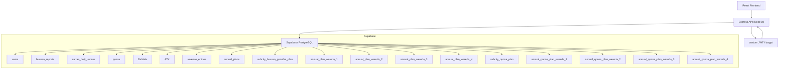
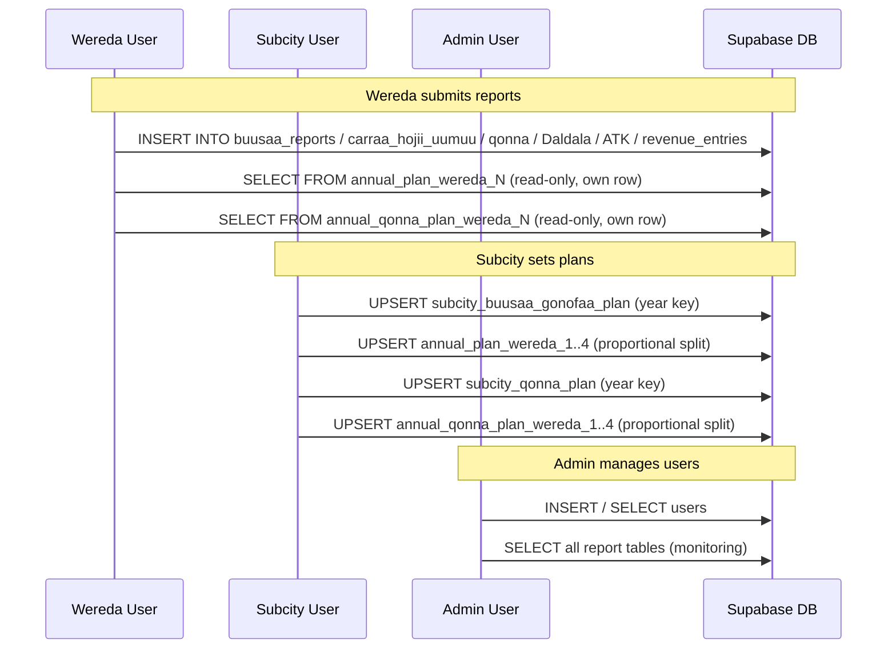

# Design Document: Database Schema Setup — Reporting and Monitoring System

## Overview

This document defines the complete PostgreSQL database schema for the Reporting and Monitoring System deployed on Supabase. The system tracks economic and agricultural activity across three administrative tiers — **admin**, **sub-city (subcity)**, and **wereda** (district) — using a custom JWT/bcrypt authentication stack (not Supabase Auth). All column names are derived directly from the existing backend controllers.

The schema covers user management, six report tables (buusaa_reports, carraa_hojii_uumuu, qonna, Daldala, ATK, revenue_entries), one generic plan table (annual_plans), one subcity-level Buusaa Gonofaa plan table (subcity_buusaa_gonofaa_plan), four per-wereda Buusaa Gonofaa plan tables (annual_plan_wereda_1 through 4), one subcity-level Qonna plan table (subcity_qonna_plan), and four per-wereda Qonna plan tables (annual_qonna_plan_wereda_1 through 4).

---

## Architecture



---

## Role & Data Flow by Role



---

## Entity Relationship Diagram (ERD)

```mermaid
erDiagram
    users {
        uuid id PK
        text username UK
        text password_hash
        text phone UK
        text role
        timestamptz created_at
    }

    buusaa_reports {
        bigint id PK
        uuid user_id FK
        text username
        text role
        date report_date
        text report_type
        numeric hubannoo_uummuu
        numeric horannaa_misensaa
        numeric buusi_jirataa
        numeric gumaata_jirataa
        numeric buusi_daldalaa
        numeric buusi_daldalaa_fi_gumaataa
        numeric inisheetevii_buusaa_gonofaa
        numeric gumaata_midhaani
        numeric nyaata_barataa
        numeric zayitii
        numeric sukkaara
        text yaada_gudinaa
        timestamptz created_at
    }

    carraa_hojii_uumuu {
        bigint id PK
        uuid user_id FK
        text username
        text role
        date report_date
        text report_type
        numeric leenjii
        numeric carraa_hojii_dhaabbii
        numeric carraa_hojii_qacarrii
        numeric qusannaa_haawaasaa
        numeric qusanna_dirqii
        numeric kenna_liqii
        numeric deebii_liqii_bilchaate
        numeric deebii_liqii_bulee
        numeric industrii_godoo
        text yaada_gudinaa
        timestamptz created_at
    }

    qonna {
        bigint id PK
        uuid user_id FK
        text username
        text role
        date report_date
        text report_type
        numeric furdisa_bakka_qophaawe
        numeric furdisa_sheedii_ijaaraman
        numeric furdisa_lakk_horii
        numeric annan_bakka_qophaawe
        numeric annan_sheedii_ijaaraman
        numeric annan_lakk_saaa
        numeric lukkuu_bakka_qophaawe
        numeric lukkuu_sheedii_ijaaraman
        numeric lukkuu_lakk_lukkuu
        numeric boyyee_bakka_qophaawe
        numeric boyyee_sheedii_ijaaraman
        numeric boyyee_lakk_booyyee
        numeric kannisaa_bakka_qophaawe
        numeric kannisaa_gaaguraa_ijaaraman
        numeric kannisaa_lakk_kannisaa
        numeric qurxummii_bakka_qophaawe
        numeric qurxummii_pondii_ijaaraman
        numeric qurxummii_lakk_qurxummii
        text yaada_gudinaa
        timestamptz created_at
    }

    Daldala {
        bigint id PK
        uuid user_id FK
        text username
        text role
        date report_date
        text report_type
        numeric galmee_haraa
        numeric heyyema_haraa
        numeric harahessaa
        numeric galii_daldalarra_galuu
        numeric toannoo_walii_gala
        numeric tmd
        numeric intarshippii
        numeric ggg
        numeric gabayaa_sanbata
        numeric whg_kudraa
        numeric whg_mudraa
        text yaada_gudinaa
        timestamptz created_at
    }

    ATK {
        bigint id PK
        uuid user_id FK
        text username
        text role
        date report_date
        text report_type
        numeric waliigaltee_pilaanii_kennuu
        numeric heeyyama_ijaarsaa_kennamee
        numeric toannoo_fi_hordoffii_gamoo
        numeric galii_atk_galchuu
        text yaada_gudinaa
        timestamptz created_at
    }

    revenue_entries {
        bigint id PK
        text username
        text gosa_galii
        text madda_galii
        numeric baasii
        date guyyaa
        date report_date
        timestamptz created_at
    }

    annual_plans {
        bigint id PK
        uuid user_id FK
        integer year
        numeric hubannoo_uummuu_target
        numeric horannaa_misensaa_target
        numeric buusi_jirataa_target
        numeric buusi_daldalaa_target
        timestamptz created_at
    }

    subcity_buusaa_gonofaa_plan {
        bigint id PK
        integer year UK
        numeric hubannoo_uummuu
        numeric horannaa_misensaa
        numeric buusi_jiraataa
        numeric gumaata_jirataa
        numeric buusi_daldalaa
        numeric inisheetivii_buusaa_gonofaa
        numeric gumaata_mootummaa
        numeric nyaata_barataa
        numeric sukkaara
        numeric zayitii
        numeric weight_w1
        numeric weight_w2
        numeric weight_w3
        numeric weight_w4
        timestamptz created_at
    }

    annual_plan_wereda_1 {
        bigint id PK
        integer year UK
        numeric hubannoo_uummuu_target
        numeric horannaa_misensaa_target
        numeric buusi_jiraataa_target
        numeric gumaata_jirataa_target
        numeric buusi_daldalaa_target
        numeric inisheetivii_buusaa_gonofaa_target
        numeric gumaata_mootummaa_target
        numeric nyaata_barataa_target
        numeric sukkaara_target
        numeric zayitii_target
        timestamptz created_at
    }

    subcity_qonna_plan {
        bigint id PK
        integer year UK
        numeric furdisa_qophi_lafa
        numeric furdisa_lakk_sheedii
        numeric furdisa_lakk_horii_waliigalaa
        numeric annan_qophi_lafa
        numeric annan_lakk_sheedii
        numeric annan_lakk_saa_waliigalaa
        numeric lukkuu_qophi_lafa
        numeric lukkuu_lakk_sheedii
        numeric lukkuu_lakk_lukkuu_waliigalaa
        numeric booyee_qophi_lafa
        numeric booyee_lakk_sheedii
        numeric booyee_lakk_booyyee_waliigalaa
        numeric kannisaa_qophi_lafa
        numeric kannisaa_lakk_gaaguraa
        numeric kannisaa_lakk_kannisaa_waliigalaa
        numeric qurxummii_qophi_lafa
        numeric qurxummii_lakk_pondii
        numeric qurxummii_lakk_qurxummii_waliigalaa
        timestamptz created_at
    }

    annual_qonna_plan_wereda_1 {
        bigint id PK
        integer year UK
        numeric furdisa_qophi_lafa_target
        numeric furdisa_lakk_sheedii_target
        numeric furdisa_lakk_horii_waliigalaa_target
        numeric annan_qophi_lafa_target
        numeric annan_lakk_sheedii_target
        numeric annan_lakk_saa_waliigalaa_target
        numeric lukkuu_qophi_lafa_target
        numeric lukkuu_lakk_sheedii_target
        numeric lukkuu_lakk_lukkuu_waliigalaa_target
        numeric booyee_qophi_lafa_target
        numeric booyee_lakk_sheedii_target
        numeric booyee_lakk_booyyee_waliigalaa_target
        numeric kannisaa_qophi_lafa_target
        numeric kannisaa_lakk_gaaguraa_target
        numeric kannisaa_lakk_kannisaa_waliigalaa_target
        numeric qurxummii_qophi_lafa_target
        numeric qurxummii_lakk_pondii_target
        numeric qurxummii_lakk_qurxummii_waliigalaa_target
        timestamptz created_at
    }

    users ||--o{ buusaa_reports : "user_id"
    users ||--o{ carraa_hojii_uumuu : "user_id"
    users ||--o{ qonna : "user_id"
    users ||--o{ Daldala : "user_id"
    users ||--o{ ATK : "user_id"
    users ||--o{ annual_plans : "user_id"
```



> **Notes on ERD scope**: `revenue_entries` links by `username` (text), not by `user_id` UUID, because the controller stores only the username string. The four `annual_plan_wereda_2/3/4` and `annual_qonna_plan_wereda_2/3/4` tables are structurally identical to their `_1` counterparts and are omitted above for diagram clarity.

---

## Components and Interfaces

### 1. Authentication Layer

**Purpose**: Register and authenticate users using bcrypt password hashing and custom JWT tokens. Supabase Auth is **not** used.

**Interface**:
```typescript
interface AuthController {
  register(username: string, password: string, phone: string, role: 'admin' | 'sub-city' | 'wereda'): Promise<void>
  login(username: string, password: string): Promise<{ token: string, user: UserPublic }>
}

interface JWTPayload {
  id: string        // users.id (UUID)
  username: string  // users.username
  role: string      // users.role
}
```

**Responsibilities**:
- Hash passwords with `bcrypt` (10 rounds) before storing
- Enforce unique username and unique phone at DB level (UNIQUE constraints)
- Sign JWT with `JWT_SECRET` from `.env`, 24-hour expiry
- Middleware decodes token into `req.user` for downstream controllers

---

### 2. Report Tables

**Purpose**: Each report table stores periodic submissions (daily/weekly/monthly) from wereda users. All tables share the same `user_id`/`username`/`role` identity columns and a `report_date` + `report_type` pair.

**Shared Report Interface**:
```typescript
interface ReportBase {
  user_id: string    // FK → users.id
  username: string
  role: string
  report_date: string  // ISO date 'YYYY-MM-DD'
  report_type: string  // e.g. "Buusaa Gonofaa", "Monthly Report"
  yaada_gudinaa?: string
}
```

**Tables**:
- `buusaa_reports` — Buusaa Gonofaa cooperative reporting
- `carraa_hojii_uumuu` — Employment creation reporting
- `qonna` — Agricultural livestock/poultry/fish reporting
- `Daldala` — Trade and commerce reporting
- `ATK` — Construction and building permits reporting
- `revenue_entries` — Revenue collection entries (linked by username, not UUID)

---

### 3. Plan Tables

**Purpose**: Plans are set once per year by the subcity and distributed proportionally to each wereda. Wereda users can read their own plan rows but cannot write to plan tables.

**Plan Hierarchy**:
- `annual_plans` — Generic per-user plan (wereda-level, locked after creation)
- `subcity_buusaa_gonofaa_plan` — Subcity totals + wereda weight percentages for Buusaa Gonofaa
- `annual_plan_wereda_1..4` — Proportional per-wereda targets, upserted by subcity
- `subcity_qonna_plan` — Subcity totals for all Qonna categories
- `annual_qonna_plan_wereda_1..4` — Proportional per-wereda Qonna targets

---

## Data Models

### users
```sql
id            UUID PRIMARY KEY DEFAULT gen_random_uuid()
username      TEXT NOT NULL UNIQUE
password_hash TEXT NOT NULL
phone         TEXT NOT NULL UNIQUE
role          TEXT NOT NULL  -- 'admin' | 'sub-city' | 'wereda'
created_at    TIMESTAMPTZ DEFAULT now()
```

### buusaa_reports
```sql
id                           BIGINT GENERATED ALWAYS AS IDENTITY PRIMARY KEY
user_id                      UUID REFERENCES users(id) ON DELETE SET NULL
username                     TEXT
role                         TEXT
report_date                  DATE NOT NULL
report_type                  TEXT
hubannoo_uummuu              NUMERIC DEFAULT 0
horannaa_misensaa            NUMERIC DEFAULT 0
buusi_jirataa                NUMERIC DEFAULT 0
gumaata_jirataa              NUMERIC DEFAULT 0
buusi_daldalaa               NUMERIC DEFAULT 0
buusi_daldalaa_fi_gumaataa   NUMERIC DEFAULT 0
inisheetevii_buusaa_gonofaa  NUMERIC DEFAULT 0
gumaata_midhaani             NUMERIC DEFAULT 0
nyaata_barataa               NUMERIC DEFAULT 0
zayitii                      NUMERIC DEFAULT 0
sukkaara                     NUMERIC DEFAULT 0
yaada_gudinaa                TEXT
created_at                   TIMESTAMPTZ DEFAULT now()
```

> **Note**: The frontend sends `inisheetivii_buusaa_gonofaa` (with 'ivii'); the controller maps it to the DB column `inisheetevii_buusaa_gonofaa` (with 'evii'). The DDL uses the DB spelling.

### carraa_hojii_uumuu
```sql
id                       BIGINT GENERATED ALWAYS AS IDENTITY PRIMARY KEY
user_id                  UUID REFERENCES users(id) ON DELETE SET NULL
username                 TEXT
role                     TEXT
report_date              DATE NOT NULL
report_type              TEXT
leenjii                  NUMERIC DEFAULT 0
carraa_hojii_dhaabbii    NUMERIC DEFAULT 0
carraa_hojii_qacarrii    NUMERIC DEFAULT 0
qusannaa_haawaasaa       NUMERIC DEFAULT 0
qusanna_dirqii           NUMERIC DEFAULT 0
kenna_liqii              NUMERIC DEFAULT 0
deebii_liqii_bilchaate   NUMERIC DEFAULT 0
deebii_liqii_bulee       NUMERIC DEFAULT 0
industrii_godoo          NUMERIC DEFAULT 0
yaada_gudinaa            TEXT
created_at               TIMESTAMPTZ DEFAULT now()
```

### qonna
```sql
id                          BIGINT GENERATED ALWAYS AS IDENTITY PRIMARY KEY
user_id                     UUID REFERENCES users(id) ON DELETE SET NULL
username                    TEXT
role                        TEXT
report_date                 DATE NOT NULL
report_type                 TEXT
furdisa_bakka_qophaawe      NUMERIC DEFAULT 0
furdisa_sheedii_ijaaraman   NUMERIC DEFAULT 0
furdisa_lakk_horii          NUMERIC DEFAULT 0
annan_bakka_qophaawe        NUMERIC DEFAULT 0
annan_sheedii_ijaaraman     NUMERIC DEFAULT 0
annan_lakk_saaa             NUMERIC DEFAULT 0
lukkuu_bakka_qophaawe       NUMERIC DEFAULT 0
lukkuu_sheedii_ijaaraman    NUMERIC DEFAULT 0
lukkuu_lakk_lukkuu          NUMERIC DEFAULT 0
boyyee_bakka_qophaawe       NUMERIC DEFAULT 0
boyyee_sheedii_ijaaraman    NUMERIC DEFAULT 0
boyyee_lakk_booyyee         NUMERIC DEFAULT 0
kannisaa_bakka_qophaawe     NUMERIC DEFAULT 0
kannisaa_gaaguraa_ijaaraman NUMERIC DEFAULT 0
kannisaa_lakk_kannisaa      NUMERIC DEFAULT 0
qurxummii_bakka_qophaawe    NUMERIC DEFAULT 0
qurxummii_pondii_ijaaraman  NUMERIC DEFAULT 0
qurxummii_lakk_qurxummii    NUMERIC DEFAULT 0
yaada_gudinaa               TEXT
created_at                  TIMESTAMPTZ DEFAULT now()
```

### Daldala
```sql
id                     BIGINT GENERATED ALWAYS AS IDENTITY PRIMARY KEY
user_id                UUID REFERENCES users(id) ON DELETE SET NULL
username               TEXT
role                   TEXT
report_date            DATE NOT NULL
report_type            TEXT
galmee_haraa           NUMERIC DEFAULT 0
heyyema_haraa          NUMERIC DEFAULT 0
harahessaa             NUMERIC DEFAULT 0
galii_daldalarra_galuu NUMERIC DEFAULT 0
toannoo_walii_gala     NUMERIC DEFAULT 0
tmd                    NUMERIC DEFAULT 0
intarshippii           NUMERIC DEFAULT 0
ggg                    NUMERIC DEFAULT 0
gabayaa_sanbata        NUMERIC DEFAULT 0
whg_kudraa             NUMERIC DEFAULT 0
whg_mudraa             NUMERIC DEFAULT 0
yaada_gudinaa          TEXT
created_at             TIMESTAMPTZ DEFAULT now()
```

### ATK
```sql
id                            BIGINT GENERATED ALWAYS AS IDENTITY PRIMARY KEY
user_id                       UUID REFERENCES users(id) ON DELETE SET NULL
username                      TEXT
role                          TEXT
report_date                   DATE NOT NULL
report_type                   TEXT
waliigaltee_pilaanii_kennuu   NUMERIC DEFAULT 0
heeyyama_ijaarsaa_kennamee    NUMERIC DEFAULT 0
toannoo_fi_hordoffii_gamoo    NUMERIC DEFAULT 0
galii_atk_galchuu             NUMERIC DEFAULT 0
yaada_gudinaa                 TEXT
created_at                    TIMESTAMPTZ DEFAULT now()
```

### revenue_entries
```sql
id          BIGINT GENERATED ALWAYS AS IDENTITY PRIMARY KEY
username    TEXT
gosa_galii  TEXT
madda_galii TEXT
baasii      NUMERIC DEFAULT 0
guyyaa      DATE
report_date DATE
created_at  TIMESTAMPTZ DEFAULT now()
```

### annual_plans
```sql
id                        BIGINT GENERATED ALWAYS AS IDENTITY PRIMARY KEY
user_id                   UUID REFERENCES users(id) ON DELETE SET NULL
year                      INTEGER NOT NULL
hubannoo_uummuu_target    NUMERIC DEFAULT 0
horannaa_misensaa_target  NUMERIC DEFAULT 0
buusi_jirataa_target      NUMERIC DEFAULT 0
buusi_daldalaa_target     NUMERIC DEFAULT 0
created_at                TIMESTAMPTZ DEFAULT now()
UNIQUE (user_id, year)
```

### subcity_buusaa_gonofaa_plan
```sql
id                           BIGINT GENERATED ALWAYS AS IDENTITY PRIMARY KEY
year                         INTEGER NOT NULL UNIQUE
hubannoo_uummuu              NUMERIC DEFAULT 0
horannaa_misensaa            NUMERIC DEFAULT 0
buusi_jiraataa               NUMERIC DEFAULT 0
gumaata_jirataa              NUMERIC DEFAULT 0
buusi_daldalaa               NUMERIC DEFAULT 0
inisheetivii_buusaa_gonofaa  NUMERIC DEFAULT 0
gumaata_mootummaa            NUMERIC DEFAULT 0
nyaata_barataa               NUMERIC DEFAULT 0
sukkaara                     NUMERIC DEFAULT 0
zayitii                      NUMERIC DEFAULT 0
weight_w1                    NUMERIC DEFAULT 0
weight_w2                    NUMERIC DEFAULT 0
weight_w3                    NUMERIC DEFAULT 0
weight_w4                    NUMERIC DEFAULT 0
created_at                   TIMESTAMPTZ DEFAULT now()
```

### annual_plan_wereda_N (N = 1..4, identical structure)
```sql
id                                   BIGINT GENERATED ALWAYS AS IDENTITY PRIMARY KEY
year                                 INTEGER NOT NULL UNIQUE
hubannoo_uummuu_target               NUMERIC DEFAULT 0
horannaa_misensaa_target             NUMERIC DEFAULT 0
buusi_jiraataa_target                NUMERIC DEFAULT 0
gumaata_jirataa_target               NUMERIC DEFAULT 0
buusi_daldalaa_target                NUMERIC DEFAULT 0
inisheetivii_buusaa_gonofaa_target   NUMERIC DEFAULT 0
gumaata_mootummaa_target             NUMERIC DEFAULT 0
nyaata_barataa_target                NUMERIC DEFAULT 0
sukkaara_target                      NUMERIC DEFAULT 0
zayitii_target                       NUMERIC DEFAULT 0
created_at                           TIMESTAMPTZ DEFAULT now()
```

### subcity_qonna_plan
```sql
id                                  BIGINT GENERATED ALWAYS AS IDENTITY PRIMARY KEY
year                                INTEGER NOT NULL UNIQUE
furdisa_qophi_lafa                  NUMERIC DEFAULT 0
furdisa_lakk_sheedii                NUMERIC DEFAULT 0
furdisa_lakk_horii_waliigalaa       NUMERIC DEFAULT 0
annan_qophi_lafa                    NUMERIC DEFAULT 0
annan_lakk_sheedii                  NUMERIC DEFAULT 0
annan_lakk_saa_waliigalaa           NUMERIC DEFAULT 0
lukkuu_qophi_lafa                   NUMERIC DEFAULT 0
lukkuu_lakk_sheedii                 NUMERIC DEFAULT 0
lukkuu_lakk_lukkuu_waliigalaa       NUMERIC DEFAULT 0
booyee_qophi_lafa                   NUMERIC DEFAULT 0
booyee_lakk_sheedii                 NUMERIC DEFAULT 0
booyee_lakk_booyyee_waliigalaa      NUMERIC DEFAULT 0
kannisaa_qophi_lafa                 NUMERIC DEFAULT 0
kannisaa_lakk_gaaguraa              NUMERIC DEFAULT 0
kannisaa_lakk_kannisaa_waliigalaa   NUMERIC DEFAULT 0
qurxummii_qophi_lafa                NUMERIC DEFAULT 0
qurxummii_lakk_pondii               NUMERIC DEFAULT 0
qurxummii_lakk_qurxummii_waliigalaa NUMERIC DEFAULT 0
created_at                          TIMESTAMPTZ DEFAULT now()
```

### annual_qonna_plan_wereda_N (N = 1..4, identical structure)
```sql
id                                         BIGINT GENERATED ALWAYS AS IDENTITY PRIMARY KEY
year                                       INTEGER NOT NULL UNIQUE
furdisa_qophi_lafa_target                  NUMERIC DEFAULT 0
furdisa_lakk_sheedii_target                NUMERIC DEFAULT 0
furdisa_lakk_horii_waliigalaa_target       NUMERIC DEFAULT 0
annan_qophi_lafa_target                    NUMERIC DEFAULT 0
annan_lakk_sheedii_target                  NUMERIC DEFAULT 0
annan_lakk_saa_waliigalaa_target           NUMERIC DEFAULT 0
lukkuu_qophi_lafa_target                   NUMERIC DEFAULT 0
lukkuu_lakk_sheedii_target                 NUMERIC DEFAULT 0
lukkuu_lakk_lukkuu_waliigalaa_target       NUMERIC DEFAULT 0
booyee_qophi_lafa_target                   NUMERIC DEFAULT 0
booyee_lakk_sheedii_target                 NUMERIC DEFAULT 0
booyee_lakk_booyyee_waliigalaa_target      NUMERIC DEFAULT 0
kannisaa_qophi_lafa_target                 NUMERIC DEFAULT 0
kannisaa_lakk_gaaguraa_target              NUMERIC DEFAULT 0
kannisaa_lakk_kannisaa_waliigalaa_target   NUMERIC DEFAULT 0
qurxummii_qophi_lafa_target                NUMERIC DEFAULT 0
qurxummii_lakk_pondii_target               NUMERIC DEFAULT 0
qurxummii_lakk_qurxummii_waliigalaa_target NUMERIC DEFAULT 0
created_at                                 TIMESTAMPTZ DEFAULT now()
```

---

## Error Handling

| Scenario | DB Behavior | API Response |
|---|---|---|
| Duplicate username on register | UNIQUE constraint violation | 400 "Username already exists." |
| Duplicate phone on register | UNIQUE constraint violation | 400 "Phone number already registered." |
| Login with wrong password | Application-level bcrypt mismatch | 401 "Invalid username or password." |
| Duplicate annual plan (same user + year) | UNIQUE(user_id, year) on `annual_plans` | 409 "Annual plan already submitted and locked." |
| Subcity upserts plan | `ON CONFLICT (year) DO UPDATE` | 200 idempotent |
| FK violation on report insert | `ON DELETE SET NULL` on user_id | Graceful null, row preserved |

---

## Security Considerations

- **No Supabase Auth**: RLS (Row Level Security) is not used by default since the app manages authorization in the Express middleware layer. If RLS is enabled on Supabase, the service-role key must be used in the backend client so middleware-controlled access is not blocked.
- **Password storage**: bcrypt with 10 rounds — safe against brute-force at current compute levels.
- **JWT secret**: Must be a long random string stored in `.env`, never committed to VCS.
- **SQL injection**: Supabase JS client uses parameterized queries internally; no raw SQL strings are concatenated with user input in these controllers.
- **Phone and username uniqueness**: Enforced at the DB level as a second line of defense beyond the application checks.

---

## Testing Strategy

### Unit Testing Approach

Test each controller function with mocked Supabase client responses:
- Auth: register duplicate user, login wrong password, login success
- Reports: insert valid payload, insert with missing required fields
- Plans: create plan twice (409 conflict), subcity upsert idempotency

### Property-Based Testing Approach

**Property Test Library**: fast-check

Key properties to verify:
- For any valid `entries` array in revenue submission, the number of rows inserted equals `entries.length`
- For any subcity plan with weights [w1, w2, w3, w4] that sum to 100, the sum of all four wereda `_target` values for any field equals `Math.round(subcityTotal)` (±1 due to rounding)
- `annual_plans` UNIQUE(user_id, year) means a second insert for the same user+year always returns a conflict

### Integration Testing Approach

Run against a local Supabase instance or a dedicated test project:
- Full register → login → submit report → fetch report cycle per report type
- Subcity save plan → wereda fetch plan cycle
- Verify that `annual_plan_wereda_N` rows are proportionally correct after subcity saves

---

## Dependencies

| Dependency | Version (from package.json) | Purpose |
|---|---|---|
| `@supabase/supabase-js` | latest | Supabase client for DB queries |
| `bcrypt` | latest | Password hashing |
| `jsonwebtoken` | latest | JWT sign / verify |
| `express` | latest | HTTP server / routing |

---

## Complete SQL DDL (ready to run in Supabase SQL Editor)

Paste the entire block below into the **Supabase SQL Editor** and click **Run**. It is safe to run repeatedly — each table uses `CREATE TABLE IF NOT EXISTS`.

```sql
-- ============================================================
-- Reporting & Monitoring System — Complete Database Schema
-- Compatible with: Supabase (PostgreSQL 15+)
-- Auth: Custom JWT / bcrypt (NOT Supabase Auth)
-- Run in: Supabase Dashboard → SQL Editor
-- ============================================================

-- ──────────────────────────────────────────────────────────────
-- 1. USERS
-- ──────────────────────────────────────────────────────────────
CREATE TABLE IF NOT EXISTS users (
    id            UUID PRIMARY KEY DEFAULT gen_random_uuid(),
    username      TEXT NOT NULL UNIQUE,
    password_hash TEXT NOT NULL,
    phone         TEXT NOT NULL UNIQUE,
    role          TEXT NOT NULL CHECK (role IN ('admin', 'sub-city', 'wereda')),
    created_at    TIMESTAMPTZ DEFAULT now()
);

-- ──────────────────────────────────────────────────────────────
-- 2. BUUSAA REPORTS
-- Note: DB column is inisheetevii_... (with 'evii')
--       Frontend sends   inisheetivii_... (with 'ivii')
--       Controller maps the two spellings at the app layer.
-- ──────────────────────────────────────────────────────────────
CREATE TABLE IF NOT EXISTS buusaa_reports (
    id                           BIGINT GENERATED ALWAYS AS IDENTITY PRIMARY KEY,
    user_id                      UUID REFERENCES users(id) ON DELETE SET NULL,
    username                     TEXT,
    role                         TEXT,
    report_date                  DATE NOT NULL,
    report_type                  TEXT,
    hubannoo_uummuu              NUMERIC DEFAULT 0,
    horannaa_misensaa            NUMERIC DEFAULT 0,
    buusi_jirataa                NUMERIC DEFAULT 0,
    gumaata_jirataa              NUMERIC DEFAULT 0,
    buusi_daldalaa               NUMERIC DEFAULT 0,
    buusi_daldalaa_fi_gumaataa   NUMERIC DEFAULT 0,
    inisheetevii_buusaa_gonofaa  NUMERIC DEFAULT 0,
    gumaata_midhaani             NUMERIC DEFAULT 0,
    nyaata_barataa               NUMERIC DEFAULT 0,
    zayitii                      NUMERIC DEFAULT 0,
    sukkaara                     NUMERIC DEFAULT 0,
    yaada_gudinaa                TEXT,
    created_at                   TIMESTAMPTZ DEFAULT now()
);

CREATE INDEX IF NOT EXISTS idx_buusaa_reports_user_id
    ON buusaa_reports (user_id);
CREATE INDEX IF NOT EXISTS idx_buusaa_reports_report_date
    ON buusaa_reports (report_date DESC);

-- ──────────────────────────────────────────────────────────────
-- 3. CARRAA HOJII UUMUU (Employment Creation)
-- ──────────────────────────────────────────────────────────────
CREATE TABLE IF NOT EXISTS carraa_hojii_uumuu (
    id                       BIGINT GENERATED ALWAYS AS IDENTITY PRIMARY KEY,
    user_id                  UUID REFERENCES users(id) ON DELETE SET NULL,
    username                 TEXT,
    role                     TEXT,
    report_date              DATE NOT NULL,
    report_type              TEXT,
    leenjii                  NUMERIC DEFAULT 0,
    carraa_hojii_dhaabbii    NUMERIC DEFAULT 0,
    carraa_hojii_qacarrii    NUMERIC DEFAULT 0,
    qusannaa_haawaasaa       NUMERIC DEFAULT 0,
    qusanna_dirqii           NUMERIC DEFAULT 0,
    kenna_liqii              NUMERIC DEFAULT 0,
    deebii_liqii_bilchaate   NUMERIC DEFAULT 0,
    deebii_liqii_bulee       NUMERIC DEFAULT 0,
    industrii_godoo          NUMERIC DEFAULT 0,
    yaada_gudinaa            TEXT,
    created_at               TIMESTAMPTZ DEFAULT now()
);

CREATE INDEX IF NOT EXISTS idx_carraa_hojii_user_id
    ON carraa_hojii_uumuu (user_id);
CREATE INDEX IF NOT EXISTS idx_carraa_hojii_report_date
    ON carraa_hojii_uumuu (report_date DESC);

-- ──────────────────────────────────────────────────────────────
-- 4. QONNA (Agriculture / Livestock)
-- ──────────────────────────────────────────────────────────────
CREATE TABLE IF NOT EXISTS qonna (
    id                           BIGINT GENERATED ALWAYS AS IDENTITY PRIMARY KEY,
    user_id                      UUID REFERENCES users(id) ON DELETE SET NULL,
    username                     TEXT,
    role                         TEXT,
    report_date                  DATE NOT NULL,
    report_type                  TEXT,
    furdisa_bakka_qophaawe       NUMERIC DEFAULT 0,
    furdisa_sheedii_ijaaraman    NUMERIC DEFAULT 0,
    furdisa_lakk_horii           NUMERIC DEFAULT 0,
    annan_bakka_qophaawe         NUMERIC DEFAULT 0,
    annan_sheedii_ijaaraman      NUMERIC DEFAULT 0,
    annan_lakk_saaa              NUMERIC DEFAULT 0,
    lukkuu_bakka_qophaawe        NUMERIC DEFAULT 0,
    lukkuu_sheedii_ijaaraman     NUMERIC DEFAULT 0,
    lukkuu_lakk_lukkuu           NUMERIC DEFAULT 0,
    boyyee_bakka_qophaawe        NUMERIC DEFAULT 0,
    boyyee_sheedii_ijaaraman     NUMERIC DEFAULT 0,
    boyyee_lakk_booyyee          NUMERIC DEFAULT 0,
    kannisaa_bakka_qophaawe      NUMERIC DEFAULT 0,
    kannisaa_gaaguraa_ijaaraman  NUMERIC DEFAULT 0,
    kannisaa_lakk_kannisaa       NUMERIC DEFAULT 0,
    qurxummii_bakka_qophaawe     NUMERIC DEFAULT 0,
    qurxummii_pondii_ijaaraman   NUMERIC DEFAULT 0,
    qurxummii_lakk_qurxummii     NUMERIC DEFAULT 0,
    yaada_gudinaa                TEXT,
    created_at                   TIMESTAMPTZ DEFAULT now()
);

CREATE INDEX IF NOT EXISTS idx_qonna_user_id
    ON qonna (user_id);
CREATE INDEX IF NOT EXISTS idx_qonna_report_date
    ON qonna (report_date DESC);

-- ──────────────────────────────────────────────────────────────
-- 5. DALDALA (Trade)
-- Table name is exactly "Daldala" (capital D) as in the controller.
-- ──────────────────────────────────────────────────────────────
CREATE TABLE IF NOT EXISTS "Daldala" (
    id                     BIGINT GENERATED ALWAYS AS IDENTITY PRIMARY KEY,
    user_id                UUID REFERENCES users(id) ON DELETE SET NULL,
    username               TEXT,
    role                   TEXT,
    report_date            DATE NOT NULL,
    report_type            TEXT,
    galmee_haraa           NUMERIC DEFAULT 0,
    heyyema_haraa          NUMERIC DEFAULT 0,
    harahessaa             NUMERIC DEFAULT 0,
    galii_daldalarra_galuu NUMERIC DEFAULT 0,
    toannoo_walii_gala     NUMERIC DEFAULT 0,
    tmd                    NUMERIC DEFAULT 0,
    intarshippii           NUMERIC DEFAULT 0,
    ggg                    NUMERIC DEFAULT 0,
    gabayaa_sanbata        NUMERIC DEFAULT 0,
    whg_kudraa             NUMERIC DEFAULT 0,
    whg_mudraa             NUMERIC DEFAULT 0,
    yaada_gudinaa          TEXT,
    created_at             TIMESTAMPTZ DEFAULT now()
);

CREATE INDEX IF NOT EXISTS idx_daldala_user_id
    ON "Daldala" (user_id);
CREATE INDEX IF NOT EXISTS idx_daldala_report_date
    ON "Daldala" (report_date DESC);

-- ──────────────────────────────────────────────────────────────
-- 6. ATK (Construction / Building Permits)
-- Table name is exactly "ATK" (all caps) as in the controller.
-- ──────────────────────────────────────────────────────────────
CREATE TABLE IF NOT EXISTS "ATK" (
    id                            BIGINT GENERATED ALWAYS AS IDENTITY PRIMARY KEY,
    user_id                       UUID REFERENCES users(id) ON DELETE SET NULL,
    username                      TEXT,
    role                          TEXT,
    report_date                   DATE NOT NULL,
    report_type                   TEXT,
    waliigaltee_pilaanii_kennuu   NUMERIC DEFAULT 0,
    heeyyama_ijaarsaa_kennamee    NUMERIC DEFAULT 0,
    toannoo_fi_hordoffii_gamoo    NUMERIC DEFAULT 0,
    galii_atk_galchuu             NUMERIC DEFAULT 0,
    yaada_gudinaa                 TEXT,
    created_at                    TIMESTAMPTZ DEFAULT now()
);

CREATE INDEX IF NOT EXISTS idx_atk_user_id
    ON "ATK" (user_id);
CREATE INDEX IF NOT EXISTS idx_atk_report_date
    ON "ATK" (report_date DESC);

-- ──────────────────────────────────────────────────────────────
-- 7. REVENUE ENTRIES
-- No FK to users — controller stores username string only.
-- ──────────────────────────────────────────────────────────────
CREATE TABLE IF NOT EXISTS revenue_entries (
    id          BIGINT GENERATED ALWAYS AS IDENTITY PRIMARY KEY,
    username    TEXT,
    gosa_galii  TEXT,
    madda_galii TEXT,
    baasii      NUMERIC DEFAULT 0,
    guyyaa      DATE,
    report_date DATE,
    created_at  TIMESTAMPTZ DEFAULT now()
);

CREATE INDEX IF NOT EXISTS idx_revenue_entries_username
    ON revenue_entries (username);
CREATE INDEX IF NOT EXISTS idx_revenue_entries_report_date
    ON revenue_entries (report_date DESC);

-- ──────────────────────────────────────────────────────────────
-- 8. ANNUAL PLANS (per wereda user, locked after creation)
-- ──────────────────────────────────────────────────────────────
CREATE TABLE IF NOT EXISTS annual_plans (
    id                        BIGINT GENERATED ALWAYS AS IDENTITY PRIMARY KEY,
    user_id                   UUID REFERENCES users(id) ON DELETE SET NULL,
    year                      INTEGER NOT NULL,
    hubannoo_uummuu_target    NUMERIC DEFAULT 0,
    horannaa_misensaa_target  NUMERIC DEFAULT 0,
    buusi_jirataa_target      NUMERIC DEFAULT 0,
    buusi_daldalaa_target     NUMERIC DEFAULT 0,
    created_at                TIMESTAMPTZ DEFAULT now(),
    UNIQUE (user_id, year)
);

-- ──────────────────────────────────────────────────────────────
-- 9. SUBCITY BUUSAA GONOFAA PLAN (subcity level, upsert on year)
-- ──────────────────────────────────────────────────────────────
CREATE TABLE IF NOT EXISTS subcity_buusaa_gonofaa_plan (
    id                          BIGINT GENERATED ALWAYS AS IDENTITY PRIMARY KEY,
    year                        INTEGER NOT NULL UNIQUE,
    hubannoo_uummuu             NUMERIC DEFAULT 0,
    horannaa_misensaa           NUMERIC DEFAULT 0,
    buusi_jiraataa              NUMERIC DEFAULT 0,
    gumaata_jirataa             NUMERIC DEFAULT 0,
    buusi_daldalaa              NUMERIC DEFAULT 0,
    inisheetivii_buusaa_gonofaa NUMERIC DEFAULT 0,
    gumaata_mootummaa           NUMERIC DEFAULT 0,
    nyaata_barataa              NUMERIC DEFAULT 0,
    sukkaara                    NUMERIC DEFAULT 0,
    zayitii                     NUMERIC DEFAULT 0,
    weight_w1                   NUMERIC DEFAULT 0,
    weight_w2                   NUMERIC DEFAULT 0,
    weight_w3                   NUMERIC DEFAULT 0,
    weight_w4                   NUMERIC DEFAULT 0,
    created_at                  TIMESTAMPTZ DEFAULT now()
);

-- ──────────────────────────────────────────────────────────────
-- 10. PER-WEREDA BUUSAA GONOFAA PLAN TABLES (4 tables)
-- ──────────────────────────────────────────────────────────────
CREATE TABLE IF NOT EXISTS annual_plan_wereda_1 (
    id                                  BIGINT GENERATED ALWAYS AS IDENTITY PRIMARY KEY,
    year                                INTEGER NOT NULL UNIQUE,
    hubannoo_uummuu_target              NUMERIC DEFAULT 0,
    horannaa_misensaa_target            NUMERIC DEFAULT 0,
    buusi_jiraataa_target               NUMERIC DEFAULT 0,
    gumaata_jirataa_target              NUMERIC DEFAULT 0,
    buusi_daldalaa_target               NUMERIC DEFAULT 0,
    inisheetivii_buusaa_gonofaa_target  NUMERIC DEFAULT 0,
    gumaata_mootummaa_target            NUMERIC DEFAULT 0,
    nyaata_barataa_target               NUMERIC DEFAULT 0,
    sukkaara_target                     NUMERIC DEFAULT 0,
    zayitii_target                      NUMERIC DEFAULT 0,
    created_at                          TIMESTAMPTZ DEFAULT now()
);

CREATE TABLE IF NOT EXISTS annual_plan_wereda_2 (
    id                                  BIGINT GENERATED ALWAYS AS IDENTITY PRIMARY KEY,
    year                                INTEGER NOT NULL UNIQUE,
    hubannoo_uummuu_target              NUMERIC DEFAULT 0,
    horannaa_misensaa_target            NUMERIC DEFAULT 0,
    buusi_jiraataa_target               NUMERIC DEFAULT 0,
    gumaata_jirataa_target              NUMERIC DEFAULT 0,
    buusi_daldalaa_target               NUMERIC DEFAULT 0,
    inisheetivii_buusaa_gonofaa_target  NUMERIC DEFAULT 0,
    gumaata_mootummaa_target            NUMERIC DEFAULT 0,
    nyaata_barataa_target               NUMERIC DEFAULT 0,
    sukkaara_target                     NUMERIC DEFAULT 0,
    zayitii_target                      NUMERIC DEFAULT 0,
    created_at                          TIMESTAMPTZ DEFAULT now()
);

CREATE TABLE IF NOT EXISTS annual_plan_wereda_3 (
    id                                  BIGINT GENERATED ALWAYS AS IDENTITY PRIMARY KEY,
    year                                INTEGER NOT NULL UNIQUE,
    hubannoo_uummuu_target              NUMERIC DEFAULT 0,
    horannaa_misensaa_target            NUMERIC DEFAULT 0,
    buusi_jiraataa_target               NUMERIC DEFAULT 0,
    gumaata_jirataa_target              NUMERIC DEFAULT 0,
    buusi_daldalaa_target               NUMERIC DEFAULT 0,
    inisheetivii_buusaa_gonofaa_target  NUMERIC DEFAULT 0,
    gumaata_mootummaa_target            NUMERIC DEFAULT 0,
    nyaata_barataa_target               NUMERIC DEFAULT 0,
    sukkaara_target                     NUMERIC DEFAULT 0,
    zayitii_target                      NUMERIC DEFAULT 0,
    created_at                          TIMESTAMPTZ DEFAULT now()
);

CREATE TABLE IF NOT EXISTS annual_plan_wereda_4 (
    id                                  BIGINT GENERATED ALWAYS AS IDENTITY PRIMARY KEY,
    year                                INTEGER NOT NULL UNIQUE,
    hubannoo_uummuu_target              NUMERIC DEFAULT 0,
    horannaa_misensaa_target            NUMERIC DEFAULT 0,
    buusi_jiraataa_target               NUMERIC DEFAULT 0,
    gumaata_jirataa_target              NUMERIC DEFAULT 0,
    buusi_daldalaa_target               NUMERIC DEFAULT 0,
    inisheetivii_buusaa_gonofaa_target  NUMERIC DEFAULT 0,
    gumaata_mootummaa_target            NUMERIC DEFAULT 0,
    nyaata_barataa_target               NUMERIC DEFAULT 0,
    sukkaara_target                     NUMERIC DEFAULT 0,
    zayitii_target                      NUMERIC DEFAULT 0,
    created_at                          TIMESTAMPTZ DEFAULT now()
);

-- ──────────────────────────────────────────────────────────────
-- 11. SUBCITY QONNA PLAN (subcity level, upsert on year)
-- ──────────────────────────────────────────────────────────────
CREATE TABLE IF NOT EXISTS subcity_qonna_plan (
    id                                   BIGINT GENERATED ALWAYS AS IDENTITY PRIMARY KEY,
    year                                 INTEGER NOT NULL UNIQUE,
    furdisa_qophi_lafa                   NUMERIC DEFAULT 0,
    furdisa_lakk_sheedii                 NUMERIC DEFAULT 0,
    furdisa_lakk_horii_waliigalaa        NUMERIC DEFAULT 0,
    annan_qophi_lafa                     NUMERIC DEFAULT 0,
    annan_lakk_sheedii                   NUMERIC DEFAULT 0,
    annan_lakk_saa_waliigalaa            NUMERIC DEFAULT 0,
    lukkuu_qophi_lafa                    NUMERIC DEFAULT 0,
    lukkuu_lakk_sheedii                  NUMERIC DEFAULT 0,
    lukkuu_lakk_lukkuu_waliigalaa        NUMERIC DEFAULT 0,
    booyee_qophi_lafa                    NUMERIC DEFAULT 0,
    booyee_lakk_sheedii                  NUMERIC DEFAULT 0,
    booyee_lakk_booyyee_waliigalaa       NUMERIC DEFAULT 0,
    kannisaa_qophi_lafa                  NUMERIC DEFAULT 0,
    kannisaa_lakk_gaaguraa               NUMERIC DEFAULT 0,
    kannisaa_lakk_kannisaa_waliigalaa    NUMERIC DEFAULT 0,
    qurxummii_qophi_lafa                 NUMERIC DEFAULT 0,
    qurxummii_lakk_pondii                NUMERIC DEFAULT 0,
    qurxummii_lakk_qurxummii_waliigalaa  NUMERIC DEFAULT 0,
    created_at                           TIMESTAMPTZ DEFAULT now()
);

-- ──────────────────────────────────────────────────────────────
-- 12. PER-WEREDA QONNA PLAN TABLES (4 tables)
-- ──────────────────────────────────────────────────────────────
CREATE TABLE IF NOT EXISTS annual_qonna_plan_wereda_1 (
    id                                          BIGINT GENERATED ALWAYS AS IDENTITY PRIMARY KEY,
    year                                        INTEGER NOT NULL UNIQUE,
    furdisa_qophi_lafa_target                   NUMERIC DEFAULT 0,
    furdisa_lakk_sheedii_target                 NUMERIC DEFAULT 0,
    furdisa_lakk_horii_waliigalaa_target        NUMERIC DEFAULT 0,
    annan_qophi_lafa_target                     NUMERIC DEFAULT 0,
    annan_lakk_sheedii_target                   NUMERIC DEFAULT 0,
    annan_lakk_saa_waliigalaa_target            NUMERIC DEFAULT 0,
    lukkuu_qophi_lafa_target                    NUMERIC DEFAULT 0,
    lukkuu_lakk_sheedii_target                  NUMERIC DEFAULT 0,
    lukkuu_lakk_lukkuu_waliigalaa_target        NUMERIC DEFAULT 0,
    booyee_qophi_lafa_target                    NUMERIC DEFAULT 0,
    booyee_lakk_sheedii_target                  NUMERIC DEFAULT 0,
    booyee_lakk_booyyee_waliigalaa_target       NUMERIC DEFAULT 0,
    kannisaa_qophi_lafa_target                  NUMERIC DEFAULT 0,
    kannisaa_lakk_gaaguraa_target               NUMERIC DEFAULT 0,
    kannisaa_lakk_kannisaa_waliigalaa_target    NUMERIC DEFAULT 0,
    qurxummii_qophi_lafa_target                 NUMERIC DEFAULT 0,
    qurxummii_lakk_pondii_target                NUMERIC DEFAULT 0,
    qurxummii_lakk_qurxummii_waliigalaa_target  NUMERIC DEFAULT 0,
    created_at                                  TIMESTAMPTZ DEFAULT now()
);

CREATE TABLE IF NOT EXISTS annual_qonna_plan_wereda_2 (
    id                                          BIGINT GENERATED ALWAYS AS IDENTITY PRIMARY KEY,
    year                                        INTEGER NOT NULL UNIQUE,
    furdisa_qophi_lafa_target                   NUMERIC DEFAULT 0,
    furdisa_lakk_sheedii_target                 NUMERIC DEFAULT 0,
    furdisa_lakk_horii_waliigalaa_target        NUMERIC DEFAULT 0,
    annan_qophi_lafa_target                     NUMERIC DEFAULT 0,
    annan_lakk_sheedii_target                   NUMERIC DEFAULT 0,
    annan_lakk_saa_waliigalaa_target            NUMERIC DEFAULT 0,
    lukkuu_qophi_lafa_target                    NUMERIC DEFAULT 0,
    lukkuu_lakk_sheedii_target                  NUMERIC DEFAULT 0,
    lukkuu_lakk_lukkuu_waliigalaa_target        NUMERIC DEFAULT 0,
    booyee_qophi_lafa_target                    NUMERIC DEFAULT 0,
    booyee_lakk_sheedii_target                  NUMERIC DEFAULT 0,
    booyee_lakk_booyyee_waliigalaa_target       NUMERIC DEFAULT 0,
    kannisaa_qophi_lafa_target                  NUMERIC DEFAULT 0,
    kannisaa_lakk_gaaguraa_target               NUMERIC DEFAULT 0,
    kannisaa_lakk_kannisaa_waliigalaa_target    NUMERIC DEFAULT 0,
    qurxummii_qophi_lafa_target                 NUMERIC DEFAULT 0,
    qurxummii_lakk_pondii_target                NUMERIC DEFAULT 0,
    qurxummii_lakk_qurxummii_waliigalaa_target  NUMERIC DEFAULT 0,
    created_at                                  TIMESTAMPTZ DEFAULT now()
);

CREATE TABLE IF NOT EXISTS annual_qonna_plan_wereda_3 (
    id                                          BIGINT GENERATED ALWAYS AS IDENTITY PRIMARY KEY,
    year                                        INTEGER NOT NULL UNIQUE,
    furdisa_qophi_lafa_target                   NUMERIC DEFAULT 0,
    furdisa_lakk_sheedii_target                 NUMERIC DEFAULT 0,
    furdisa_lakk_horii_waliigalaa_target        NUMERIC DEFAULT 0,
    annan_qophi_lafa_target                     NUMERIC DEFAULT 0,
    annan_lakk_sheedii_target                   NUMERIC DEFAULT 0,
    annan_lakk_saa_waliigalaa_target            NUMERIC DEFAULT 0,
    lukkuu_qophi_lafa_target                    NUMERIC DEFAULT 0,
    lukkuu_lakk_sheedii_target                  NUMERIC DEFAULT 0,
    lukkuu_lakk_lukkuu_waliigalaa_target        NUMERIC DEFAULT 0,
    booyee_qophi_lafa_target                    NUMERIC DEFAULT 0,
    booyee_lakk_sheedii_target                  NUMERIC DEFAULT 0,
    booyee_lakk_booyyee_waliigalaa_target       NUMERIC DEFAULT 0,
    kannisaa_qophi_lafa_target                  NUMERIC DEFAULT 0,
    kannisaa_lakk_gaaguraa_target               NUMERIC DEFAULT 0,
    kannisaa_lakk_kannisaa_waliigalaa_target    NUMERIC DEFAULT 0,
    qurxummii_qophi_lafa_target                 NUMERIC DEFAULT 0,
    qurxummii_lakk_pondii_target                NUMERIC DEFAULT 0,
    qurxummii_lakk_qurxummii_waliigalaa_target  NUMERIC DEFAULT 0,
    created_at                                  TIMESTAMPTZ DEFAULT now()
);

CREATE TABLE IF NOT EXISTS annual_qonna_plan_wereda_4 (
    id                                          BIGINT GENERATED ALWAYS AS IDENTITY PRIMARY KEY,
    year                                        INTEGER NOT NULL UNIQUE,
    furdisa_qophi_lafa_target                   NUMERIC DEFAULT 0,
    furdisa_lakk_sheedii_target                 NUMERIC DEFAULT 0,
    furdisa_lakk_horii_waliigalaa_target        NUMERIC DEFAULT 0,
    annan_qophi_lafa_target                     NUMERIC DEFAULT 0,
    annan_lakk_sheedii_target                   NUMERIC DEFAULT 0,
    annan_lakk_saa_waliigalaa_target            NUMERIC DEFAULT 0,
    lukkuu_qophi_lafa_target                    NUMERIC DEFAULT 0,
    lukkuu_lakk_sheedii_target                  NUMERIC DEFAULT 0,
    lukkuu_lakk_lukkuu_waliigalaa_target        NUMERIC DEFAULT 0,
    booyee_qophi_lafa_target                    NUMERIC DEFAULT 0,
    booyee_lakk_sheedii_target                  NUMERIC DEFAULT 0,
    booyee_lakk_booyyee_waliigalaa_target       NUMERIC DEFAULT 0,
    kannisaa_qophi_lafa_target                  NUMERIC DEFAULT 0,
    kannisaa_lakk_gaaguraa_target               NUMERIC DEFAULT 0,
    kannisaa_lakk_kannisaa_waliigalaa_target    NUMERIC DEFAULT 0,
    qurxummii_qophi_lafa_target                 NUMERIC DEFAULT 0,
    qurxummii_lakk_pondii_target                NUMERIC DEFAULT 0,
    qurxummii_lakk_qurxummii_waliigalaa_target  NUMERIC DEFAULT 0,
    created_at                                  TIMESTAMPTZ DEFAULT now()
);

-- ──────────────────────────────────────────────────────────────
-- END OF SCHEMA
-- ──────────────────────────────────────────────────────────────
```

---

## Important Implementation Notes

### Quoted Identifiers for Mixed-Case Table Names

The tables `"Daldala"` and `"ATK"` use uppercase/mixed-case names that match the controller exactly. In PostgreSQL, these **must always be quoted** when referenced:

```sql
SELECT * FROM "Daldala";
SELECT * FROM "ATK";
```

The Supabase JS client handles this automatically when you pass the string `"Daldala"` or `"ATK"` to `.from()`. No manual quoting is needed in the application code.

### RLS (Row Level Security)

The backend uses the Supabase **service-role key** (set in `backend/config/supabase.js`), which bypasses RLS entirely. This is intentional — all access control is enforced in the Express middleware. Do **not** enable RLS on these tables unless you also update the client initialization to use the service-role key explicitly.

### Wereda-to-Table Mapping

The controller hard-codes this mapping (defined in `planController.js`):

| Username | Wereda ID | Plan Table |
|---|---|---|
| Aanaa Gooroo | w1 | annual_plan_wereda_1 / annual_qonna_plan_wereda_1 |
| Aanaa Dhadacha Araaraa | w2 | annual_plan_wereda_2 / annual_qonna_plan_wereda_2 |
| Aanaa Dhakaa Adii | w3 | annual_plan_wereda_3 / annual_qonna_plan_wereda_3 |
| Aanaa Andoodee | w4 | annual_plan_wereda_4 / annual_qonna_plan_wereda_4 |

These usernames must be registered exactly as shown in the `users` table for the wereda dashboard to resolve its plan correctly.

### `inisheetevii` vs `inisheetivii` Spelling

- **DB column**: `inisheetevii_buusaa_gonofaa` (in `buusaa_reports`)
- **Frontend payload key**: `inisheetivii_buusaa_gonofaa`
- **Mapping**: done in `reportController.js` at the app layer — no DB migration needed

Keep this mapping in place to avoid breaking existing frontend payloads.
