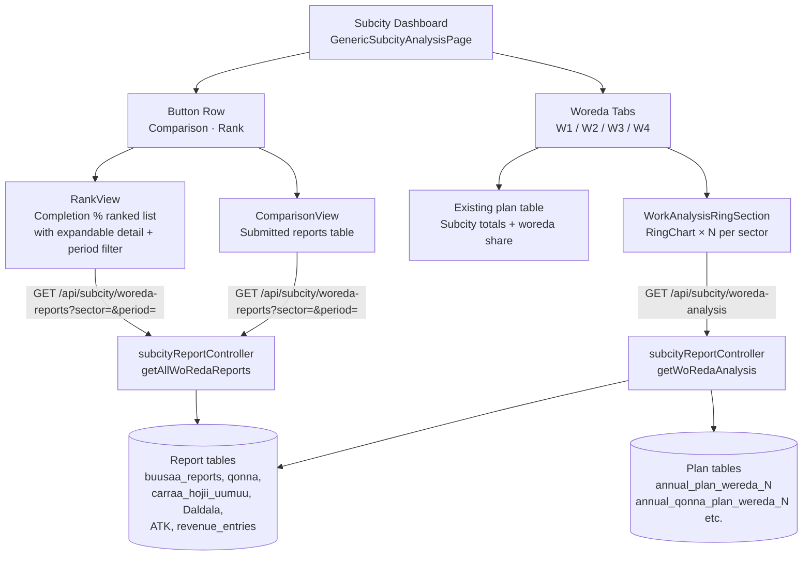
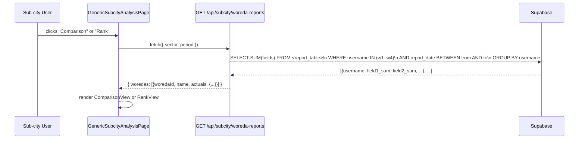
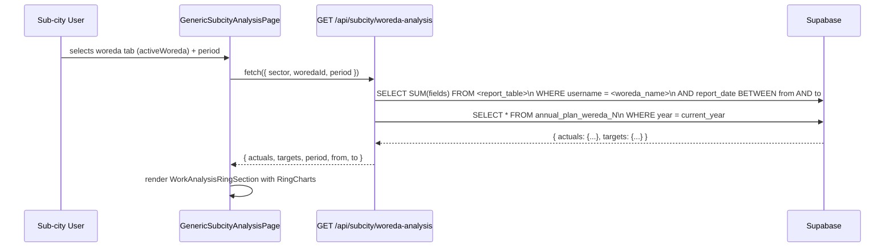

# Design Document: Subcity Work Analysis Enhancement

## Overview

This feature enhances the Subcity Dashboard's Work Analysis page (`GenericSubcityAnalysisPage`) with three major additions: (1) Comparison and Rank buttons that give the subcity manager a cross-woreda view of *actual submitted work* (not just plan targets), (2) per-woreda ring charts embedded from the woreda dashboard's `RingChart` component to show actual vs. target per field for the selected woreda and sector, and (3) full Supabase database backing for all data — no stub data.

The work builds entirely on top of the existing `GenericSubcityAnalysisPage`, adding new UI modes below the existing 4-woreda tab row and a new ring-chart section at the bottom of the tab content. The backend gains two new API endpoints: one that returns all four woredas' submitted-report sums for a given sector and period (used by Comparison and Rank), and one that returns a single woreda's plan targets + actuals for ring chart display.

---

## Architecture



### Key Design Decisions

- **No new DB tables.** All data is read from existing report and plan tables.
- **Single new controller file** (`subcityReportController.js`) — keeps plan and report logic separate and avoids bloating existing controllers.
- **Two new API routes** mounted under `/api/subcity` — easy to protect with the existing `authMiddleware`.
- **`RingChart` reused verbatim** — copied as a shared utility or imported from a common location; the woreda dashboard retains its own copy to avoid coupling.
- **Period filter** on Rank detail uses the same `daily/weekly/monthly/annual` vocabulary already used throughout the system.

---

## Sequence Diagrams

### Comparison / Rank Button Click



### Ring Charts for Selected Woreda Tab



---

## Components and Interfaces

### Component 1: `GenericSubcityAnalysisPage` (enhanced)

**Purpose**: Top-level page component for Work Analysis. Now manages `activeView` state (`"woreda" | "comparison" | "rank"`) and renders additional sub-sections.

**New state**:
```typescript
activeView: "woreda" | "comparison" | "rank"
```

**Changes to existing layout**:
1. Existing woreda tabs row — unchanged.
2. After the tabs row, insert the new **Comparison & Rank button row**.
3. When `activeView === "woreda"`, show existing plan table + new `WorkAnalysisRingSection` below it.
4. When `activeView === "comparison"`, replace the plan area with `ComparisonView`.
5. When `activeView === "rank"`, replace the plan area with `RankView`.

---

### Component 2: `ComparisonView`

**Purpose**: Shows a table of actual submitted report data per woreda per field for the selected sector and period.

**Props**:
```typescript
interface ComparisonViewProps {
  sector: string          // "buusaa" | "qonna" | "galii" | "carraa" | "daldala" | "atk"
  fields: FieldDef[]      // from SECTOR_CFG[sector].fields
  cfg: SectorCfg          // gradient, label, color
}

interface FieldDef {
  key: string
  label: string
  color: string
}
```

**Internal state**:
```typescript
period: "daily" | "weekly" | "monthly" | "annual"   // default "monthly"
data: WoRedaActuals[] | null
loading: boolean
error: string
```

**Behavior**:
- On mount and when `period` changes, call `GET /api/subcity/woreda-reports?sector=&period=`.
- Renders a period selector (Daily / Weekly / Monthly / Yearly).
- Renders a table: rows = fields, columns = 4 woredas, cells = summed actual values.
- Shows a loading spinner while fetching.

---

### Component 3: `RankView`

**Purpose**: Shows the 4 woredas ranked by their overall completion percentage (sum of actuals / sum of targets × 100), highest first.

**Props**: same as `ComparisonView`.

**Internal state**:
```typescript
period: "daily" | "weekly" | "monthly" | "annual"  // default "monthly"
rankData: RankedWoreda[] | null
loading: boolean
expandedWoreda: string | null   // woredaId of the expanded detail row
```

```typescript
interface RankedWoreda {
  woredaId: string         // "w1" | "w2" | "w3" | "w4"
  name: string
  completionPct: number    // (totalActuals / totalTargets) * 100, rounded to 1dp
  actuals: Record<string, number>
  targets: Record<string, number>
}
```

**Behavior**:
- Fetches `GET /api/subcity/woreda-reports?sector=&period=` for actuals.
- Fetches plan targets from the existing plan loaded in parent (passed via props or re-fetched).
- Sorts by `completionPct` descending.
- Each row is clickable: toggles `expandedWoreda`.
- Expanded row shows a detail panel: plan target vs. submitted per field.
- Detail panel has its own period filter (Daily / Weekly / Monthly / Yearly).
- When period changes in detail panel, re-fetches actuals for that woreda only.

---

### Component 4: `WorkAnalysisRingSection`

**Purpose**: Embedded ring charts showing actual vs. target per field for the currently selected woreda and sector.

**Props**:
```typescript
interface WorkAnalysisRingSectionProps {
  sector: string           // "buusaa" | "qonna" | "galii" | "carraa" | "daldala" | "atk"
  woredaId: string         // "w1" | "w2" | "w3" | "w4"
  fields: FieldDef[]
  cfg: SectorCfg
}
```

**Internal state**:
```typescript
period: "daily" | "weekly" | "monthly" | "annual"   // default "monthly"
actuals: Record<string, number> | null
targets: Record<string, number> | null
loading: boolean
error: string
```

**Behavior**:
- On mount and when `woredaId` or `period` changes, calls `GET /api/subcity/woreda-analysis?sector=&woredaId=&period=`.
- Renders the same `RingChart` component used in `woredadashboard.jsx` (extracted to a shared utility, or duplicated with identical signature).
- Lays out ring charts in a responsive grid: `grid-cols-2 sm:grid-cols-3 lg:grid-cols-4` — matching the woreda dashboard layout.
- Shows a period selector (Daily / Weekly / Monthly / Yearly).

---

### Component 5: `RingChart` (shared utility)

**Purpose**: SVG ring chart showing percentage completion. Extracted from `woredadashboard.jsx` for reuse.

**Props** (identical to existing):
```typescript
interface RingChartProps {
  actual: number
  target: number
  color: string
  label: string
  description: string
}
```

**Implementation path**: Create `frontend/src/components/ui/RingChart.jsx` as the canonical copy. Update `woredadashboard.jsx` to import from there. `subcitydashboard.jsx` also imports from there.

---

## Data Models

### API Response: `GET /api/subcity/woreda-reports`

```typescript
interface WoRedaReportsResponse {
  woredas: WoRedaActuals[]
  sector: string
  period: string
  from: string    // ISO date
  to: string      // ISO date
}

interface WoRedaActuals {
  woredaId: string          // "w1" | "w2" | "w3" | "w4"
  name: string              // "Aanaa Gooroo" etc.
  actuals: Record<string, number>   // field key → summed value
}
```

### API Response: `GET /api/subcity/woreda-analysis`

```typescript
interface WoRedaAnalysisResponse {
  woredaId: string
  name: string
  sector: string
  period: string
  from: string
  to: string
  actuals: Record<string, number>   // report field key → sum
  targets: Record<string, number>   // plan field key → target value
}
```

### Ranked Woreda (frontend computed)

```typescript
interface RankedWoreda {
  woredaId: string
  name: string
  completionPct: number       // rounded to 1 decimal place
  actuals: Record<string, number>
  targets: Record<string, number>
  rank: number                // 1-based position
}
```

---

## Backend: New API Endpoints

### `GET /api/subcity/woreda-reports`

**Query params**: `sector`, `period` (`daily | weekly | monthly | annual`)

**Auth**: JWT, sub-city role (or any authenticated user — same as existing plan routes).

**Controller**: `getAllWoRedaReports(req, res)` in `subcityReportController.js`

**Logic**:
1. Determine `from`/`to` date range from `period` (same logic as `getSummary` in `planController.js`).
2. Look up the correct report table for the `sector` using `SECTOR_REPORT_TABLE_MAP`.
3. For each of the 4 woreda usernames, run a `SELECT SUM(field) ... WHERE username = ? AND report_date BETWEEN ? AND ?` query, or use a single query grouped by username.
4. Map username → `woredaId` using `USERNAME_TO_WEREDA_ID`.
5. Return the `WoRedaReportsResponse` shape.

**Supabase query pattern** (one call, grouped by username):
```javascript
const { data } = await supabase
  .from(reportTable)
  .select(`username, ${fields.join(", ")}`)
  .in("username", WOREDA_USERNAMES)
  .gte("report_date", from)
  .lte("report_date", to)
```
Then aggregate in JS (Supabase PostgREST does not expose GROUP BY directly in the JS client; summing per-username is done client-side in the controller).

---

### `GET /api/subcity/woreda-analysis`

**Query params**: `sector`, `woredaId` (`w1 | w2 | w3 | w4`), `period`

**Auth**: JWT.

**Controller**: `getWoRedaAnalysis(req, res)` in `subcityReportController.js`

**Logic**:
1. Resolve woreda username from `woredaId` using `WOREDA_ID_TO_USERNAME` (inverse of `USERNAME_TO_WEREDA_ID`).
2. Determine date range from `period`.
3. Fetch report sums for that username from `SECTOR_REPORT_TABLE_MAP[sector]`.
4. Fetch plan targets from `SECTOR_PLAN_TABLE_MAP[sector][woredaId]`.
5. Return `WoRedaAnalysisResponse`.

---

### New route file: `backend/routes/subcityRoutes.js`

```javascript
router.get("/woreda-reports", authMiddleware, getAllWoRedaReports)
router.get("/woreda-analysis", authMiddleware, getWoRedaAnalysis)
```

Mounted in `server.js` as `app.use("/api/subcity", subcityRoutes)`.

---

## Key Functions with Formal Specifications

### `getDateRange(period)`

```javascript
function getDateRange(period: "daily"|"weekly"|"monthly"|"annual"): { from: string, to: string }
```

**Preconditions**:
- `period` is one of the four accepted values.

**Postconditions**:
- Returns ISO date strings `{ from, to }` where `to` is today and `from` is the start of the requested period.
- `from <= to` always holds.
- For `"annual"`: `from` = Jan 1 of the current Gregorian year.
- For `"monthly"`: `from` = 1st of the current Gregorian month.
- For `"weekly"`: `from` = most recent Sunday (Gregorian).
- For `"daily"`: `from === to` (today only).

---

### `aggregateByWoreda(rows, fields, usernameToId)`

```javascript
function aggregateByWoreda(
  rows: ReportRow[],
  fields: string[],
  usernameToId: Record<string, string>
): Record<string, Record<string, number>>
```

**Preconditions**:
- `rows` is a (possibly empty) array of report rows each with `username` and numeric field columns.
- `fields` lists exactly the column names that should be summed.

**Postconditions**:
- Returns an object keyed by `woredaId` (`w1`..`w4`).
- Each value is an object with one entry per field in `fields`, containing the sum of that field across all rows for that woreda.
- Woredas with no rows still appear in the result with all fields set to `0`.
- No mutation of input arrays.

**Loop invariants**:
- After processing each row, `result[woredaId][field]` equals the sum of `field` over all rows processed so far for that woreda.

---

### `computeCompletionPct(actuals, targets, fields)`

```javascript
function computeCompletionPct(
  actuals: Record<string, number>,
  targets: Record<string, number>,
  fields: string[]
): number
```

**Preconditions**:
- `fields` is non-empty.
- All values in `actuals` and `targets` are ≥ 0.

**Postconditions**:
- Returns a number in `[0, 100]` (capped at 100).
- If `totalTarget === 0`, returns `0` (avoids division by zero).
- Result is rounded to one decimal place.
- `completionPct = min(100, round1dp( sum(actuals[f]) / sum(targets[f]) × 100 ))`.

---

### `partitionTarget(annualTarget, period)`

Already exists in `woredadashboard.jsx`. Reused as-is:

```javascript
function partitionTarget(annual: number, period: string): number
```

Maps an annual target to the period equivalent: divides by 365/52/12/1 for daily/weekly/monthly/annual.

---

## Frontend API Functions (new additions to `planApi.js` or new `subcityApi.js`)

```typescript
// Returns all 4 woredas' actual sums for a sector+period
async function fetchWoRedaReports(sector: string, period: string): Promise<WoRedaReportsResponse>

// Returns one woreda's actuals + targets for ring charts
async function fetchWoRedaAnalysis(
  sector: string,
  woredaId: string,
  period: string
): Promise<WoRedaAnalysisResponse>
```

Both use `authHeader()` and call the new `/api/subcity/*` endpoints.

---

## Sector → Report Table Mapping (backend constant)

```javascript
const SECTOR_REPORT_TABLE_MAP = {
  buusaa:  "buusaa_reports",
  qonna:   "qonna",
  carraa:  "carraa_hojii_uumuu",
  daldala: "Daldala",       // quoted in Supabase
  atk:     "ATK",           // quoted in Supabase
  galii:   "revenue_entries",
}
```

### Sector → Report Fields Mapping

```javascript
const SECTOR_REPORT_FIELDS = {
  buusaa: [
    "hubannoo_uummuu", "horannaa_misensaa", "buusi_jirataa",
    "gumaata_jiraataa", "buusi_daldalaa", "buusi_daldalaa_fi_gumaataa",
    "inisheetevii_buusaa_gonofaa", "gumaata_midhaani",
    "nyaata_barataa", "zayitii", "sukkaara"
  ],
  qonna: [
    "furdisa_bakka_qophaawe", "furdisa_sheedii_ijaaraman", "furdisa_lakk_horii",
    "annan_bakka_qophaawe", "annan_sheedii_ijaaraman", "annan_lakk_saaa",
    "lukkuu_bakka_qophaawe", "lukkuu_sheedii_ijaaraman", "lukkuu_lakk_lukkuu",
    "boyyee_bakka_qophaawe", "boyyee_sheedii_ijaaraman", "boyyee_lakk_booyyee",
    "kannisaa_bakka_qophaawe", "kannisaa_gaaguraa_ijaaraman", "kannisaa_lakk_kannisaa",
    "qurxummii_bakka_qophaawe", "qurxummii_pondii_ijaaraman", "qurxummii_lakk_qurxummii"
  ],
  carraa: [
    "leenjii", "carraa_hojii_dhaabbii", "carraa_hojii_qacarrii",
    "qusannaa_haawaasaa", "qusanna_dirqii", "kenna_liqii",
    "deebii_liqii_bilchaate", "deebii_liqii_bulee", "industrii_godoo"
  ],
  daldala: [
    "galmee_haraa", "heyyema_haraa", "harahessaa", "galii_daldalarra_galuu",
    "toannoo_walii_gala", "tmd", "intarshippii", "ggg",
    "gabayaa_sanbata", "whg_kudraa", "whg_mudraa"
  ],
  atk: [
    "waliigaltee_pilaanii_kennuu", "heeyyama_ijaarsaa_kennamee",
    "toannoo_fi_hordoffii_gamoo", "galii_atk_galchuu"
  ],
  galii: ["baasii"],   // revenue_entries uses baasii as the amount column
}
```

### Sector → Plan Table Mapping (per woreda)

```javascript
const SECTOR_PLAN_TABLE_MAP = {
  buusaa:  { w1: "annual_plan_wereda_1",         w2: "annual_plan_wereda_2",         w3: "annual_plan_wereda_3",         w4: "annual_plan_wereda_4"         },
  qonna:   { w1: "annual_qonna_plan_wereda_1",   w2: "annual_qonna_plan_wereda_2",   w3: "annual_qonna_plan_wereda_3",   w4: "annual_qonna_plan_wereda_4"   },
  carraa:  { w1: "annual_carraa_plan_wereda_1",  w2: "annual_carraa_plan_wereda_2",  w3: "annual_carraa_plan_wereda_3",  w4: "annual_carraa_plan_wereda_4"  },
  daldala: { w1: "annual_daldala_plan_wereda_1", w2: "annual_daldala_plan_wereda_2", w3: "annual_daldala_plan_wereda_3", w4: "annual_daldala_plan_wereda_4" },
  atk:     { w1: "annual_atk_plan_wereda_1",     w2: "annual_atk_plan_wereda_2",     w3: "annual_atk_plan_wereda_3",     w4: "annual_atk_plan_wereda_4"     },
  galii:   { w1: "annual_revenue_plan_wereda_1", w2: "annual_revenue_plan_wereda_2", w3: "annual_revenue_plan_wereda_3", w4: "annual_revenue_plan_wereda_4" },
}
```

---

## Error Handling

### Error Scenario 1: No plan saved for woreda

**Condition**: `SECTOR_PLAN_TABLE_MAP[sector][woredaId]` returns a row with all zeros (or no row at all).

**Response**: Ring charts render with `target = 0`, showing 0% completion. No error thrown — the plan absence is surfaced as zero targets, matching the existing behavior in `woredadashboard.jsx`.

**Recovery**: Sub-city admin enters the plan. Charts auto-update on next fetch.

---

### Error Scenario 2: No reports submitted

**Condition**: The report table has no rows for the requested username + date range.

**Response**: `actuals` are all zeros. Comparison table shows `0` values. Rank shows 0% for that woreda.

**Recovery**: Woredas submit reports; data appears on next fetch.

---

### Error Scenario 3: Network / Supabase error on new endpoint

**Condition**: `GET /api/subcity/woreda-reports` or `GET /api/subcity/woreda-analysis` fails with 4xx/5xx.

**Response**: Component sets `error` state. Renders an inline error banner (same red alert style as existing components). The rest of the page (existing plan table) remains visible.

**Recovery**: User can retry by changing the period selector (triggers re-fetch) or navigating away and back.

---

### Error Scenario 4: `galii` sector revenue aggregation

**Condition**: `revenue_entries` stores rows per-entry, not per-report, with a `baasii` (amount) column and no separate field columns per category.

**Response**: The backend sums `baasii` per woreda as the single "actual" value for the galii sector. The frontend displays one ring chart labeled "Galii Waliigalaa" with `actual = sum(baasii)` and `target = sum(plan target fields)`.

---

## Testing Strategy

### Unit Testing Approach

Test the pure helper functions in isolation:
- `getDateRange(period)` — verify correct from/to for each of the 4 period values, including edge cases (day boundaries).
- `aggregateByWoreda(rows, fields, usernameToId)` — verify summing, zero-rows handling, unknown usernames are ignored.
- `computeCompletionPct(actuals, targets, fields)` — verify division by zero returns 0, cap at 100, correct rounding to 1dp.
- `partitionTarget(annual, period)` — existing function, no changes.

### Property-Based Testing Approach

**Property test library**: `fast-check` (already used in JS/React ecosystem).

Key properties:
- `completionPct` ∈ [0, 100] for all non-negative actuals/targets inputs.
- `aggregateByWoreda` result always contains exactly 4 entries (one per woreda) regardless of input row count.
- For any `period` in the accepted set, `getDateRange(period).from <= getDateRange(period).to`.

### Integration Testing Approach

- Mock Supabase client in controller tests; verify correct table name is selected per sector.
- Verify `getWoRedaAnalysis` returns both `actuals` and `targets` shapes with matching field keys.
- Verify authentication middleware rejects unauthenticated requests to the new routes.

---

## Performance Considerations

- **Supabase queries per page load**: The ring-chart section issues 1 request per woreda tab switch, not on every render. State is cached per `(sector, woredaId, period)` tuple; only re-fetches when one of those three changes.
- **Comparison/Rank**: Single request fetching all 4 woredas at once — one DB round-trip, not four.
- **Plan data re-use**: `GenericSubcityAnalysisPage` already fetches the plan on mount. The Rank view reuses that plan data for targets, avoiding a second plan fetch.
- **Row volume**: Report tables are filtered by `username IN (4 names) AND report_date BETWEEN ... `. Indexes on `username` and `report_date DESC` already exist in the schema (see SQL_COMMANDS_UPDATE.sql), so these queries are fast even with large row counts.

---

## Security Considerations

- New endpoints are protected by the existing `authMiddleware` (JWT validation).
- Subcity users see aggregate data across all 4 woredas — this is intentional and matches their role.
- Woreda users are not expected to call the new `/api/subcity/*` endpoints. If they do, the data returned is still only the public aggregated sums from their own tables, so there is no data leakage beyond what is already visible.
- No write operations — both new endpoints are read-only GET requests.
- `sector` and `woredaId` query parameters are validated against an allowlist in the controller before any DB query is issued.

---

## Dependencies

- **Frontend**: No new npm packages. Uses existing React, `axios` (via `api.js`), Tailwind CSS.
- **Backend**: No new npm packages. Uses existing `supabase-js` client from `backend/config/supabase.js` and `authMiddleware`.
- **Database**: No new tables. Reads from existing `buusaa_reports`, `qonna`, `carraa_hojii_uumuu`, `"Daldala"`, `"ATK"`, `revenue_entries`, and all 24 per-woreda plan tables.
- **Shared component**: `frontend/src/components/ui/RingChart.jsx` — new file extracted from `woredadashboard.jsx`'s `RingChart` function (zero behavior change, pure refactor to enable reuse).

---

## Correctness Properties

The following properties must hold universally across all inputs and states:

### Property 1: Completion percentage is bounded

For all woredas, all sectors, and all periods, `completionPct ∈ [0, 100]`. It never goes negative (actuals are non-negative sums) and is capped at 100 even when actuals exceed targets.

**Validates: Requirements 2.2** (Rank by completion percentage)

### Property 2: Rank is a total order

The ranked list always contains exactly 4 entries (one per woreda), and their rank values form a permutation of [1, 2, 3, 4] — no ties produce duplicate ranks (ties broken by woreda ID lexicographic order as a deterministic tiebreaker).

**Validates: Requirements 2.2** (Rank all 4 woredas)

### Property 3: Comparison table field coverage

For any sector, the comparison table always shows exactly the fields defined in `SECTOR_CFG[sector].fields` — no more, no fewer — regardless of what columns are present in the DB row.

**Validates: Requirements 2.1** (Comparison shows actual work per field)

### Property 4: Ring chart target consistency

The target shown in a ring chart for `(sector, woredaId, period)` equals `partitionTarget(planTarget, period)` where `planTarget` comes from the corresponding `annual_*_plan_wereda_N` table. This is the same formula already used by the woreda's own Work Analysis page.

**Validates: Requirements 3.1** (Ring charts show actual vs target per field)

### Property 5: Period filter idempotence

Selecting the same period twice in a row produces the same result (same `from`/`to` dates, same data), ensuring the UI is deterministic.

**Validates: Requirements 2.3, 3.2** (Period filter on rank detail and ring charts)

### Property 6: Zero-plan graceful degradation

If no plan exists for a woreda+sector, targets are treated as 0 and `completionPct` is returned as 0. The system never throws an error or shows `NaN`/`Infinity`.

**Validates: Requirements 3.1** (Ring charts work even when no plan is set)

### Property 7: Aggregate consistency

The sum of all four woredas' actual values (from the Comparison view) for any field equals the total reported for that field across all woreda usernames in the given date range — there is no double-counting and no row is dropped.

**Validates: Requirements 2.1, 4.1** (Live data from Supabase, correct aggregation)

### Property 8: Authentication enforcement

Every call to `GET /api/subcity/woreda-reports` and `GET /api/subcity/woreda-analysis` without a valid JWT returns HTTP 401. No data is returned unauthenticated.

**Validates: Requirements 4.2** (Secure access to live data)

### Property 9: Sector parameter allowlist

Passing an unknown `sector` value (e.g., `"invalid"`) to either new endpoint returns HTTP 400 with a descriptive error message, and no DB query is issued.

**Validates: Requirements 4.1** (Robust backend handling)

### Property 10: UI state exclusivity

At most one of `{ woreda view, comparison view, rank view }` is active at any time. Clicking "Comparison" while Rank is active immediately switches to Comparison, never showing both simultaneously.

**Validates: Requirements 1.1, 1.2** (Comparison and Rank buttons toggle distinct views)
